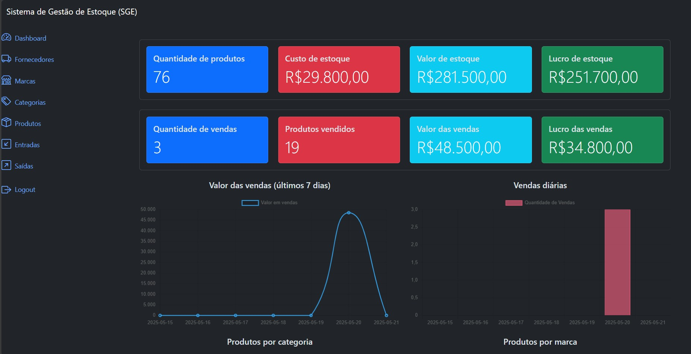
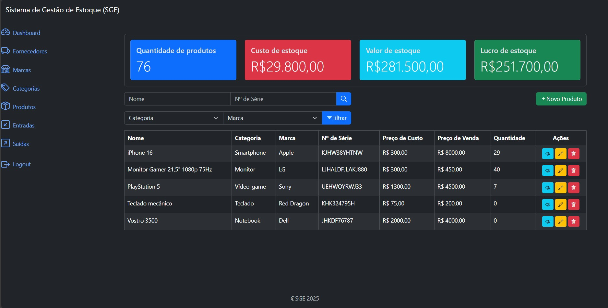

<h1 align="center" style="font-weight: bold;">Sistema de Gestão de Estoque 💻</h1>

<p align="center">
 <a href="#technologies">Tecnologias</a> • 
 <a href="#started">Início</a> • 
 <a href="#routes">Endpoints</a> •
 <a href="#contribute">Contribuições</a>
</p>

<b>O Sistema de Gestão de Estoque é uma ferramenta onde você consegue fazer o gerenciamento de produtos. Ele é capaz de cadastrar produtos e registrar suas entradas e saídas, além de exibir métricas referentes às vendas e lucro.</b>

<h2 id="layout">🎨 Layout</h2>

<p align="center">
    
    
</p>

<h3>Funcionalidades</h3>

- Cadastro de fornecedores, marcas, categorias e produtos.

- Registro de entradas e saídas de produtos.

- Dashboard com métricas de produtos, valores e lucro.

<h2 id="technologies">💻 Tecnologias</h2>

- Python
- Django
- HTML
- CSS
- Bootstrap
- PostgreSQL
- Docker

<h2 id="started">🚀 Início</h2>

Para acessar o projeto, é necessário cloná-lo do repositório do Github. Também é preciso a ferramenta Docker instalada no computador.

<h3>Clonando o projeto</h3>

Vá para o terminal e clone o repositório do Github:

```bash
https://github.com/felipe-rods/sistema_de_gestao_de_estoque.git
```

<h3>Instalando e configurando o Docker</h3>

Antes de começar a utilizar o projeto, você precisa ter instalado e configurado o Docker em seu computador. Com ele, é possível executar o projeto sem instalar nenhuma outra dependência na sua máquina, pois já está tudo configurado em contêineres. Para isso, siga as instruções no [site oficial do Docker](https://www.docker.com/get-started/).

Após a instalação e com o terminal aberto, vá para o diretório do projeto e digite o seguinte comando em seu terminal:

```bash
docker-compose up
```

Espere o sistema carregar e instalar todas as dependências do projeto. Agora, o Sistema de Gestão de Estoque está funcionando em dois contêineres diferentes, um é o próprio sistema e o outro é o banco de dados PostgreSQL. Para conferir seus atributos, abra um novo terminal, vá para o diretório do projeto e digite:

```bash
docker ps
```

<h3>Criando superusuário</h3>

Na mesma aba do terminal, na pasta do projeto, vamos criar o superusuário, com permissão de fazer login no sistema e administrá-lo pelo próprio Django. Digite os seguintes comando nele:

```bash
docker exec -it sge-sge_web-1 /bin/bash
python manage.py createsuperuser
```
Cadastre o nome de usuário, email e senha.

<h3>Endereço Base</h3>

Para acessar o projeto, use o seguinte endereço base:

```
http://localhost:8000/
```

O usuário e senha para login são os mesmos cadastrados para o superusuário. Para acessar o painel administrativo, use o endpoint `admin/`.

<h2 id="routes">📍 Endpoints</h2>

<h4>Fornecedores</h4>

- `suppliers/list/`
  - Descrição: lista de fornecedores.

- `suppliers/create/`
  - Descrição: cadastra um novo fornecedor.

- `suppliers/{id}/detail/`
  - Descrição: retorna os detalhes de um fornecedor específico.

- `suppliers/{id}/update/`
  - Descrição: atualiza um fornecedor existente.

- `suppliers/{id}/delete/`
  - Descrição: exclui um fornecedor existente.

- `api/v1/suppliers/`
  - Descrição: endpoint da API. Visualiza os fornecedores ou cadastra um novo (GET e POST).

- `api/v1/suppliers/{id}/`
  - Descrição: endpoint da API. Visualiza, atualiza ou exclui um fornecedor existente (GET, PUT e DELETE).

<h4>Marcas</h4>

- `brands/list/`
  - Descrição: lista de marcas.

- `brands/create/`
  - Descrição: cadastra uma nova marca.

- `brands/{id}/detail/`
  - Descrição: retorna os detalhes de uma marca específico.

- `brands/{id}/update/`
  - Descrição: atualiza uma marca existente.

- `brands/{id}/delete/`
  - Descrição: exclui uma marca existente.
 
- `api/v1/brands/`
  - Descrição: endpoint da API. Visualiza as marcas ou cadastra uma nova (GET e POST).

- `api/v1/brands/{id}/`
  - Descrição: endpoint da API. Visualiza, atualiza ou exclui uma marca existente (GET, PUT e DELETE).

<h4>Categorias</h4>

- `categories/list/`
  - Descrição: lista de categorias.

- `categories/create/`
  - Descrição: cadastra uma nova categoria.

- `categories/{id}/detail/`
  - Descrição: retorna os detalhes de uma categoria específico.

- `categories/{id}/update/`
  - Descrição: atualiza uma categoria existente.

- `categories/{id}/delete/`
  - Descrição: exclui uma categoria existente.
 
- `api/v1/categories/`
  - Descrição: endpoint da API. Visualiza as categorias ou cadastra uma nova (GET e POST).

- `api/v1/categories/{id}/`
  - Descrição: endpoint da API. Visualiza, atualiza ou exclui uma categoria existente (GET, PUT e DELETE).

<h4>Produtos</h4>

- `products/list/`
  - Descrição: lista de produtos.

- `products/create/`
  - Descrição: cadastra um novo produto.

- `products/{id}/detail/`
  - Descrição: retorna os detalhes de um produto específico.

- `products/{id}/update/`
  - Descrição: atualiza um produto existente.

- `products/{id}/delete/`
  - Descrição: exclui um produto existente.

- `api/v1/products/`
  - Descrição: endpoint da API. Visualiza os produtos ou cadastra um novo (GET e POST).

- `api/v1/products/{id}/`
  - Descrição: endpoint da API. Visualiza, atualiza ou exclui um produto existente (GET, PUT e DELETE).

<h4>Entradas</h4>

- `inflows/list/`
  - Descrição: lista de entradas.

- `inflows/create/`
  - Descrição: cadastra uma nova entrada.

- `inflows/{id}/detail/`
  - Descrição: retorna os detalhes de uma entrada específica.

- `api/v1/inflows/`
  - Descrição: endpoint da API. Visualiza as entradas ou cadastra uma nova (GET e POST).

- `api/v1/inflows/{id}/`
  - Descrição: endpoint da API. Visualiza, atualiza ou exclui uma entrada existente (GET, PUT e DELETE).

<h4>Saídas</h4>

- `outflows/list/`
  - Descrição: lista de saídas.

- `outflows/create/`
  - Descrição: cadastra uma nova saída.

- `outflows/{id}/detail/`
  - Descrição: retorna os detalhes de uma saída específica.

- `api/v1/outflows/`
  - Descrição: endpoint da API. Visualiza as saídas ou cadastra uma nova (GET e POST).

- `api/v1/outflows/{id}/`
  - Descrição: endpoint da API. Visualiza, atualiza ou exclui uma saída existente (GET, PUT e DELETE).

<h4>Autenticação</h4>

- `api/v1/authentication/token/`
  - Descrição: endpoint da API. Gera um novo token de acesso.

- `api/v1/authentication/token/refresh/`
  - Descrição: endpoint da API. Gera um novo token de acesso utilizando um token de refresh válido.

- `api/v1/authentication/token/verify/`
  - Descrição: endpoint da API. Verifica a validade de um token de acesso.

<h2 id="contribute">📫 Contribuições</h2>

Agradecemos o seu interesse em contribuir! Siga estas etapas:

1. Faça um fork e clone o repositório:

```bash
git clone https://github.com/felipe-rods/sistema_de_gestao_de_estoque.git
cd sistema_de_gestao_de_estoque
```

2. Crie uma nova branch:

```bash
git checkout -b feature/NAME
```

3. Faça suas modificações e commits, seguindo um padrão:

```bash
git add .
git commit -m "Descrição do que foi alterado"
```

4. Envie para o Github:
```bash
git push origin nome-da-branch
```

5. Abra um Pull Request detalhando as suas modificações. Adicione uma captura de tela das mudanças e espere pela análise.

<h3>Documentações que podem ajudar</h3>

[📝 Como criar um Pull Request](https://docs.github.com/pt/pull-requests/collaborating-with-pull-requests/proposing-changes-to-your-work-with-pull-requests/creating-a-pull-request)

[💾 Padrões de commit](https://github.com/iuricode/padroes-de-commits)

<h3>Licença</h3>

Este projeto está licenciado sob a Licença MIT. Veja o arquivo LICENSE para mais detalhes.
